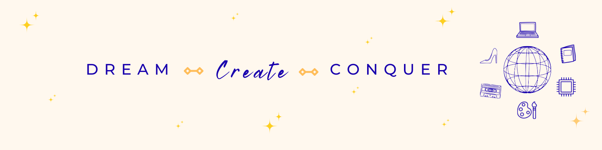
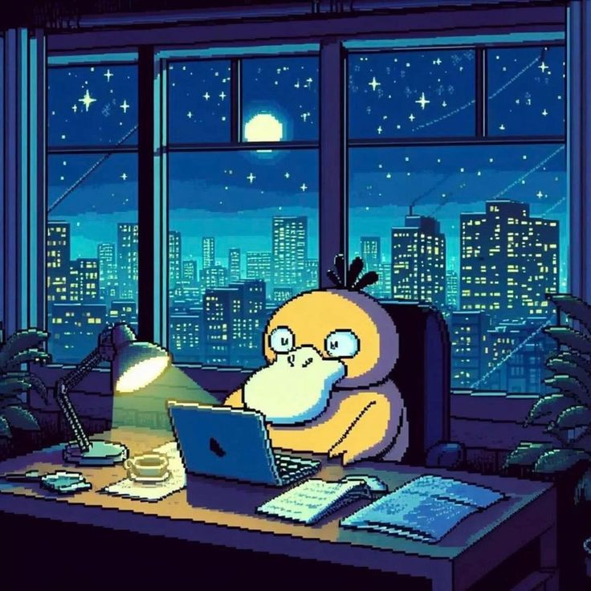

<h1 align="center">Hey, I'm Thammanna 🌻</h1>

  

<table>
  <tr>
    <td>
      <h3> About Me! </h3>
      
 I’m a creative problem-solver who loves turning ideas into things that <i>actually work</i>.   
          My interests live at the intersection of Robotics, Machine Learning, Embedded systems,
          Healthcare and Intelligent Systems — where logic meets imagination.  
          I enjoy building projects that are functional, thoughtful, and a little creative, whether  
          that’s through code, hardware, or intelligent systems that interact with the real world.
      

    </td>
    <td align="center">
      
    </td>
  </tr>
</table>

### 🧠 Things I’m Curious About
- Robotics & Human–Machine Interaction  
- Intelligent Systems & AI-driven solutions  
- Tech for healthcare & real-world impact  
- Creating things that are both useful and beautiful

### 🌸 Let’s Connect
<table>
  <tr>
    <td align = "center">
      <h6> Connect on LinkedIn!</h6>
      
    </td>
    <td align = "center">
      <h6> Drop me an E-mail!</h6>
      
    </td>
    <td align = "center">
      <h6>Check out my Portfolio!</h6>
      
    </td>
  </tr>
</table>

 <h4 align = "center">Thanks for stopping by!✨</h4>
